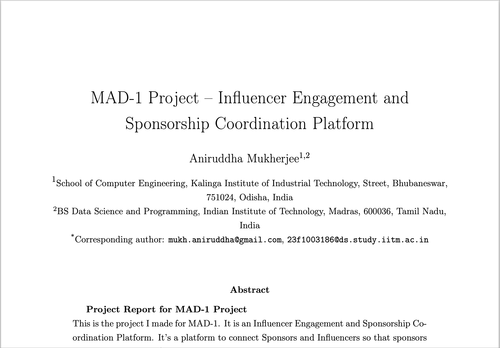

# Influencer Engagement and Sponsorship Cooridination Platform

This is the project I made for the Modern Application Development Project - 1. It is an Influencer Engagement and Sponsorship Coordination Platform. 

It connects Sponsors and Influencers so that sponsors can get their product/service advertised and influencers can get monetary benefit.

It taught me a lot.


## Demo

### YouTube Demo Link:

[](http://www.youtube.com/watch?v=LwQO7TaMMa0)


## Documentation

<a href="iitm-mad-one-iensco/iensco-web-app/MAD_1_report_final_AniruddhaMukherjee_23f1003186.pdf" class="image fit"></a>


## Tech Stack

**Client:** HTML, CSS, BootStrap, Jinja2

**Server:** Flask


## Run Locally

Clone the project

```bash
  git clone https://github.com/annimukherjee/Influencer-Engagement-and-Sponsorship-Cooridination-Platform
```

Go to the project directory

```bash
  cd Influencer-Engagement-and-Sponsorship-Cooridination-Platform/iitm-mad-one-iensco/iensco-web-app
```

Install dependencies

```bash
  pip install Flask Flask-SQLAlchemy
```

Start the app

```bash
  python app.py
```

## Features:

- **Admin Dashboard**
    - Admin can view all the users and their details.
    - Admin can view all the campaigns and their details.
    - Admin can view all the ad requests and their details.
    - Admin can view all the flagged items and their details.
    - Admin can view the statistics of the platform.
    - Admin can login to the platform.
 
- **Influencer Dashboard**
    - Influencer can view all the campaigns and their details.
    - Influencer can view all the ad requests and their details.
    - Influencer can view the statistics of the platform.
    - Influencer can login to the platform.
    - Influencer can register to the platform.
 
      
- **Sponsor Dashboard**
    - Sponsor can view all the campaigns and their details.
    - Sponsor can view all the ad requests and their details.
    - Sponsor can view the statistics of the platform.
    - Sponsor can login to the platform.
    - Sponsor can register to the platform.

    
- **Campaigns**
    - Sponsor can create a campaign.
    - Influencer can view all the campaigns.
    - Influencer can apply for a campaign.
    - Admin can view all the campaigns.
 
      
- **Ad Requests**
    - Sponsor can create an ad request.
    - Influencer can view all the ad requests.
    - Influencer can apply for an ad request.
    - Admin can view all the ad requests.
  


## Deployment

This project hasn't been deployed yet. But expect it to be soon!


## Feedback

If you have any feedback, please reach out to me at mukh.aniruddha@gmail.com


## Support

For support, email mukh.aniruddha@gmail.com.


## Authors

- [@annimukherjee](https://www.github.com/annimukherjee)


---

---

## FileTree
---

```
iitm-mad-one-iensco/
┣ iensco-web-app/
┃ ┣ __pycache__/
┃ ┃ ┗ models.cpython-310.pyc
┃ ┣ instance/
┃ ┃ ┗ influencer_platform.db
┃ ┣ templates/
┃ ┃ ┣ admin/
┃ ┃ ┃ ┣ admin_dashboard.html
┃ ┃ ┃ ┣ admin_find.html
┃ ┃ ┃ ┣ admin_stats.html
┃ ┃ ┃ ┣ flagged_items.html
┃ ┃ ┃ ┗ login_admin.html
┃ ┃ ┣ influencer/
┃ ┃ ┃ ┣ influencer_dashboard.html
┃ ┃ ┃ ┣ influencer_find.html
┃ ┃ ┃ ┣ influencer_stats.html
┃ ┃ ┃ ┣ login_influencer.html
┃ ┃ ┃ ┗ register_influencer.html
┃ ┃ ┣ sponsor/
┃ ┃ ┃ ┣ 0_register_sponsor.html
┃ ┃ ┃ ┣ 1_login_sponsor.html
┃ ┃ ┃ ┣ 2_sponsor_campaigns.html
┃ ┃ ┃ ┣ 3_sponsor_dashboard.html
┃ ┃ ┃ ┣ 4_sponsor_find.html
┃ ┃ ┃ ┣ 5_edit_campaign.html
┃ ┃ ┃ ┣ 6_sponsor_stats.html
┃ ┃ ┃ ┣ add_ad_request.html
┃ ┃ ┃ ┣ add_campaign.html
┃ ┃ ┃ ┣ campaign_details.html
┃ ┃ ┃ ┗ edit_ad_request.html
┃ ┃ ┣ views/
┃ ┃ ┃ ┣ view_ad_request.html
┃ ┃ ┃ ┣ view_campaign.html
┃ ┃ ┃ ┣ view_influencer.html
┃ ┃ ┃ ┗ view_sponsor.html
┃ ┃ ┣ base.html
┃ ┃ ┗ home.html
┃ ┣ MAD_1_report_final_AniruddhaMukherjee_23f1003186.pdf
┃ ┣ app.py
┃ ┣ insert_admin.py
┃ ┗ models.py
┗ check_sum.py
```
